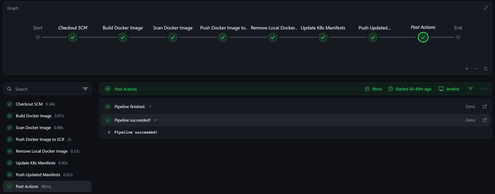
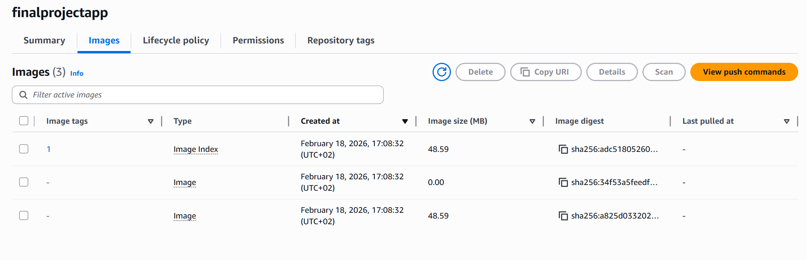
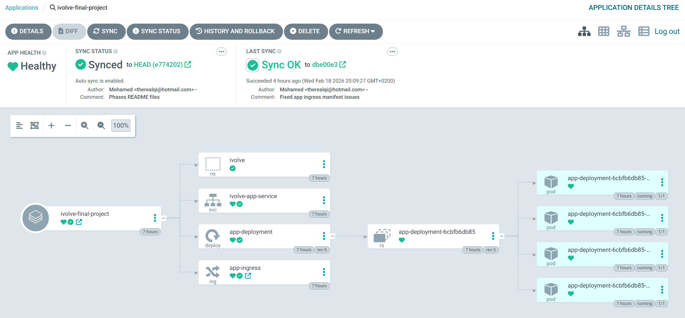
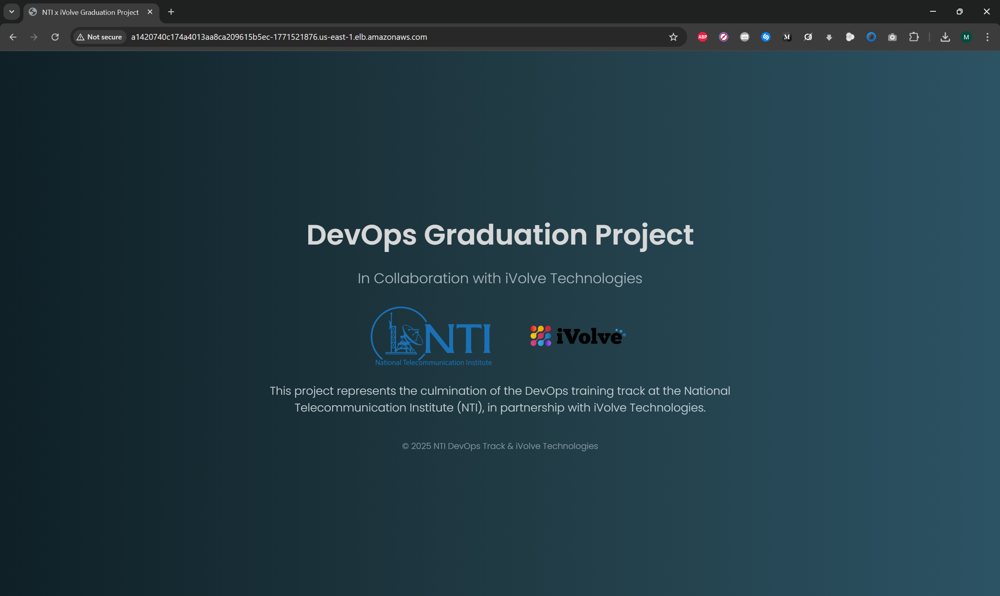

# End-to-End Cloud DevOps \& GitOps Pipeline 

This project demonstrates a complete **Cloud DevOps** lifecycle, from application containerization and infrastructure provisioning to automated GitOps deployments. Below is a summary of the project phases, architecture, and results.

## Project Phases

-   [Phase 1 & 2: Application Development & Containerization](https://github.com/TheRealQi/CloudDevOpsProject/tree/main/app)
    
-   [Phase 3: Kubernetes Manifests](https://github.com/TheRealQi/CloudDevOpsProject/tree/main/k8s)
    
-   [Phase 4: Infrastructure as Code (Terraform)](https://github.com/TheRealQi/CloudDevOpsProject/tree/main/terraform)
    
-   [Phase 5: Configuration Management (Ansible)](https://github.com/TheRealQi/CloudDevOpsProject/tree/main/ansible)
    
-   [Phase 6: Continuous Integration (Jenkins)](https://github.com/TheRealQi/CloudDevOpsProject/tree/main/jenkins)
    
-   [Phase 7: Continuous Deployment (ArgoCD)](https://github.com/TheRealQi/CloudDevOpsProject/tree/main/argocd)

----------

## 1. General Architecture & Flow

## 2. Jenkins Pipeline Success

### ECR Repo

## 3. ArgoCD Sync Status

## 4. Application Access
