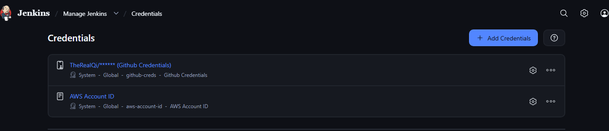
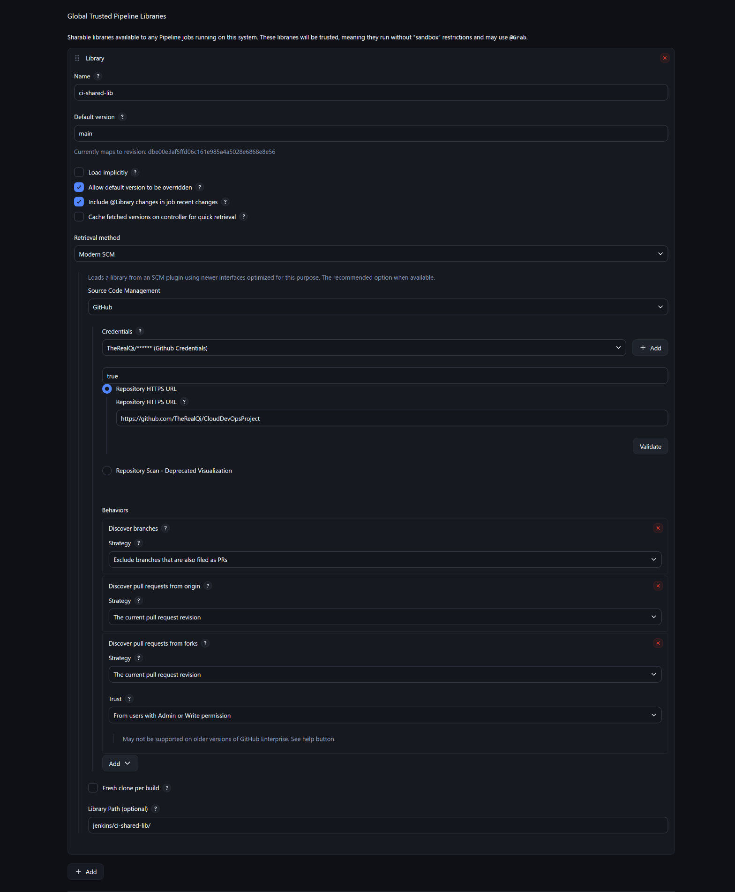
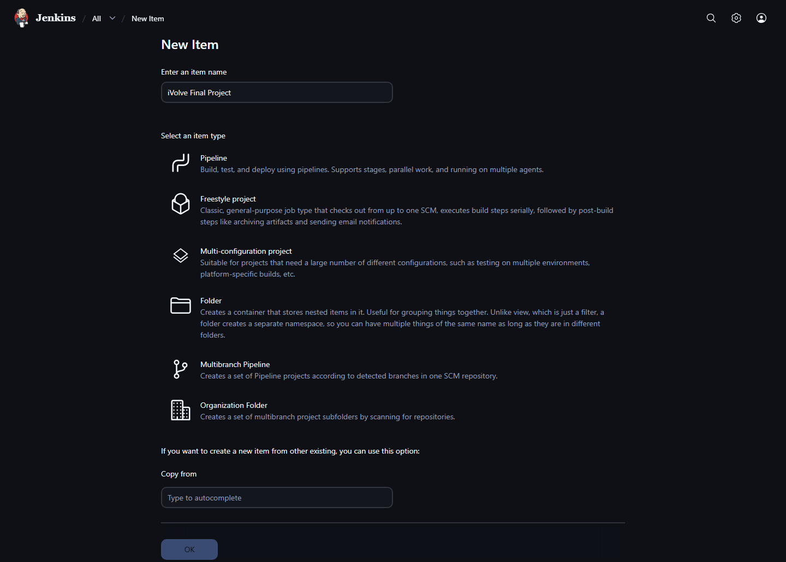
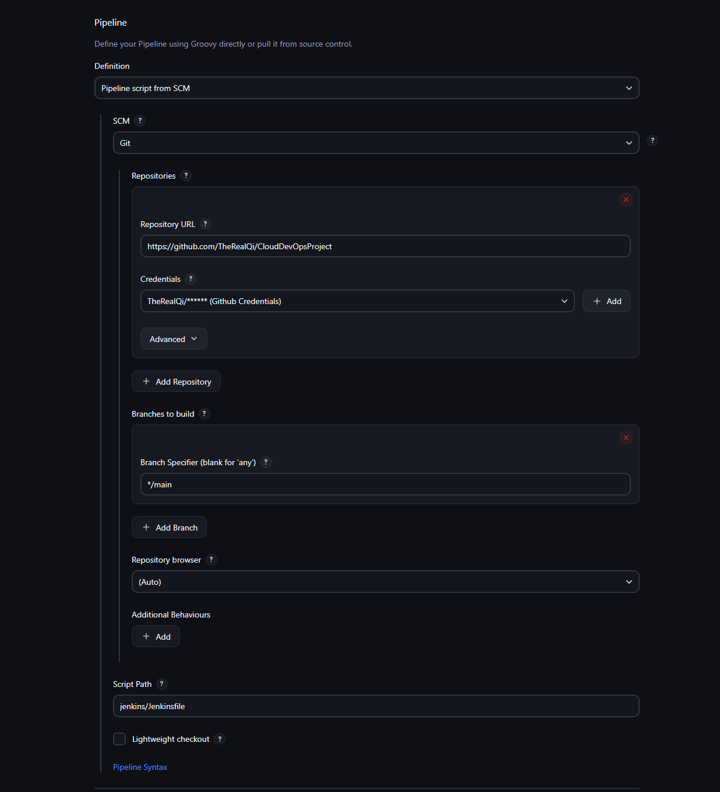

# Phase 5: Continuous Integration with Jenkins

This phase focuses on automating the application lifecycle through a Jenkins pipeline. It leverages a modular Shared Library to build, scan, and push Docker images, ultimately updating Kubernetes manifests to facilitate a GitOps deployment workflow.

---
## 0. Jenkins Dashboard Access

In this project and architecture setup, the Jenkins server resides in a private subnet. To access the Jenkins dashboard from your local machine, you will need SSH port forwarding through the bastion host:

`ssh -i bastion_admin.pem -L 8080:<jenkins-private-ip>:8080 ubuntu@<bastion-host-public-ip>` 

After running this command, you can open `http://localhost:8080` in your browser to access the Jenkins dashboard securely.
## 1. Credentials Setup

To ensure secure communication between Jenkins and external services, the following credentials must be configured in the Jenkins global credentials store:

`Manage Jenkins` > `Credentials`

| Credential ID | Type | Variable(s) | Purpose |
|:---|:---|:---|:---|
| `aws-account-id` | Secret Text | `AWS_ACCOUNT_ID` | [cite_start]Used to authenticate with Amazon ECR and construct the repository URI. |
| `github-creds` | Username/Password | `GIT_USER`, `GIT_PASS` | [cite_start]Provides authentication for pushing updated manifests back to the GitHub repository. |


---

## 2. Shared Library

### 2.1 Shared Library Setup
`Manage Jenkins` > `System` > `Global Trusted Pipeline Libraries`




### 2.1 Shared Library Methods

| Function             | File                     | Description                                               |
|----------------------|-------------------------|-----------------------------------------------------------|
| BuildImage           | BuildImage.groovy        | Executes docker build from a specified directory.|
| ScanImage            | ScanImage.groovy         | Uses Trivy to check for HIGH and CRITICAL vulnerabilities.|
| PushImage            | PushImage.groovy         | Logs into ECR and pushes the tagged image.|
| RemoveImageLocally   | RemoveImageLocally.groovy| Deletes the local Docker image using docker rmi.|
| UpdateK8sManifests   | UpdateK8sManifests.groovy| Uses sed to update the image URI in deployment.yaml.|
| PushK8sManifests     | PushK8sManifests.groovy  | Commits and pushes changes to the application repository.|


## 3. Jenkinsfile

```groovy
@Library('ci-shared-lib') _

pipeline {
    agent any

    environment {
        AWS_REGION = "us-east-1"
        AWS_ACCOUNT_ID = credentials('aws-account-id')
        IMAGE_NAME = "finalprojectapp"
        IMAGE_TAG = "${BUILD_NUMBER}"
        APPDIR = "app"
        K8SMANIFESTSDIR = "k8s"
        ECR_URI = "${AWS_ACCOUNT_ID}.dkr.ecr.${AWS_REGION}.amazonaws.com/${IMAGE_NAME}"
        GIT_BRANCH_NAME = "${env.BRANCH_NAME ?: env.GIT_BRANCH?.replace('origin/', '')}"
    }
    stages {
        stage('Build Docker Image') {
            steps {
                BuildImage(APPDIR, IMAGE_NAME, IMAGE_TAG)
            }
        }

        stage('Scan Docker Image') {
            steps {
                ScanImage(IMAGE_NAME, IMAGE_TAG)
            }
        }
        stage('Push Docker Image to ECR') {
            steps {
                PushImage(IMAGE_NAME, IMAGE_TAG, AWS_ACCOUNT_ID, AWS_REGION)
            }
        }
        stage('Remove Local Docker Image') {
            steps {
                RemoveImageLocally(IMAGE_NAME, IMAGE_TAG)
            }
        }
        stage('Update K8s Manifests') {
            steps {
                UpdateK8sManifests(K8SMANIFESTSDIR, ECR_URI, IMAGE_TAG)
            }
        }
        stage('Push Updated Manifests') {
            steps {
                script {
                    def repoUrl = scm.getUserRemoteConfigs()[0].getUrl()
                    withCredentials([usernamePassword(credentialsId: 'github-creds', usernameVariable: 'GIT_USER', passwordVariable: 'GIT_PASS')]) {
                        PushK8sManifests(K8SMANIFESTSDIR, IMAGE_TAG, repoUrl, GIT_BRANCH_NAME)
                    }
                }
            }
        }
    }
    post {
        always {
            echo "Pipeline finished."
        }
        success {
            echo "Pipeline succeeded!"
        }
        failure {
            echo "Pipeline failed!"
        }
    }
}
```

### Explanation:

### 1. Environment Variables

| Variable       | Source / Value          | Purpose                                      |
|----------------|------------------------|----------------------------------------------|
| AWS_REGION     | us-east-1              | Target AWS region for ECR.                  |
| AWS_ACCOUNT_ID | Jenkins Credentials    | Securely retrieved AWS Account ID.          |
| IMAGE_TAG      | ${BUILD_NUMBER}        | Ensures unique versioning for every build.  |
| GIT_BRANCH_NAME| Scripted Logic         | Dynamically detects the current Git branch. |


### 2. Stages
   #### 1. Build Docker Image:
   The pipeline starts by building the Docker image using the source code located in the app directory. This creates a local image tagged with the current build number.
   #### 2. Scan Docker Image
   Security is a priority. In this stage, the newly built image is scanned for vulnerabilities. This ensures that only secure images proceed further in the pipeline.

   #### 3. Push Docker Image to ECR
   Once scanned, the image is authenticated with AWS and pushed to the Amazon Elastic Container Registry (ECR) for centralized storage.

   #### 4. Remove Local Docker Image
   The local Docker image is removed immediately after the push to ECR is successful.

   #### 5. Update K8s Manifests
   The pipeline locates the Kubernetes manifests in the k8s directory and updates the image reference to the new ECR_URI and IMAGE_TAG. This ensures the deployment always points to the latest build.

   #### 6. Push Updated Manifests
   Using github-creds, the pipeline commits and pushes the updated YAML manifests back to the repository. This is a critical step for GitOps, allowing ArgoCD to automatically sync the changes to the cluster.
   
## 4. Pipeline Setup



